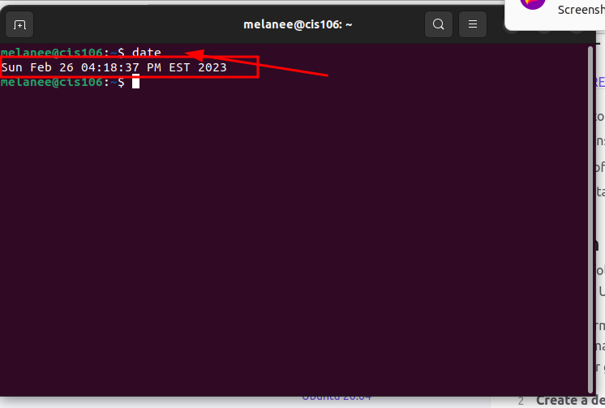
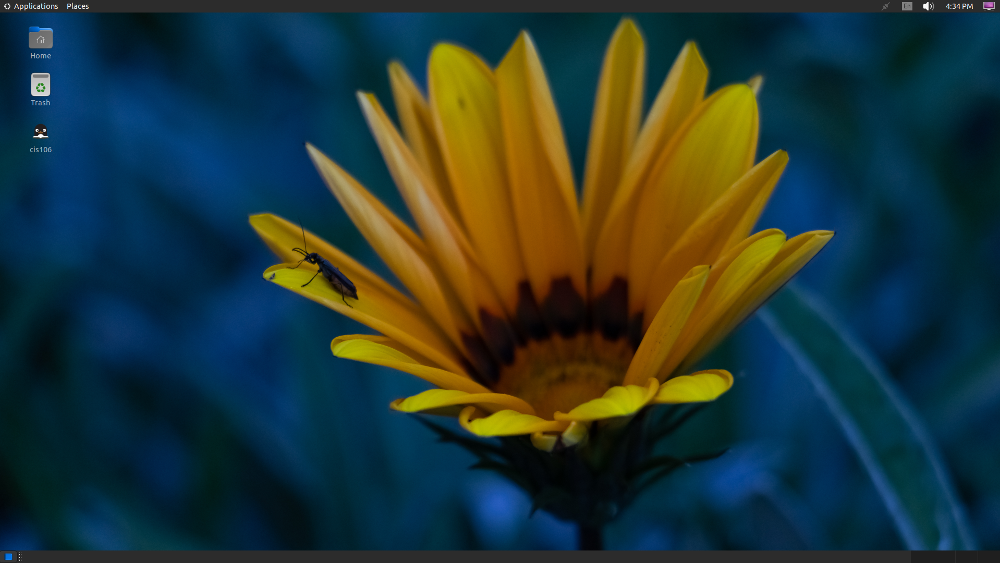

# Lab3

---
name: Melanee Sanabria
course: cis106
semester: spring 23
---
## Question1

## Question 2 

## Question 3

| Program purpose     | Package Name     | Version               |
| ------------------- | ---------------- | --------------------- |
| Play a tetris game  | xwelltris        | 1.0.1-18              |
| Play a video file   | dragonplayer     | 4:21.12.3-0ubuntu1    |
| Browse the internet | epiphany-browser | 42.4-0ubuntu1         |
| Read your email     | geary            | 40.0-2 amd64          |
| Play music          | deepin-music     | 6.0.1.54+ds.1-2build1 |

## Question 4

| command | what it does                          |
| ------- | ------------------------------------- |
| echo    | prints text                           |
| fortune | fortune teller with a cow drawing     |
| cowsay  | ascii cow drawing                     |
| lolcat  | rainbow color text                    |
| figlet  | ascii big text                        |
| toilet  | 3 colors gradient, with a border      |
| rig     | ascii drawing of a man holding a sign |

