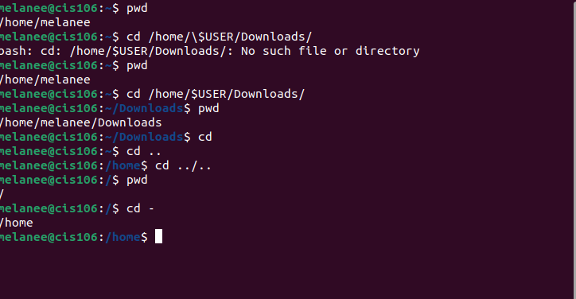
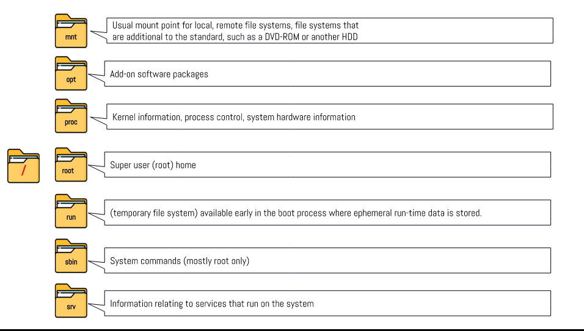
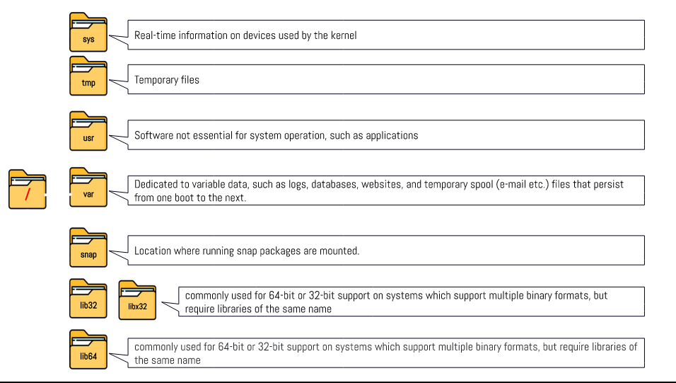
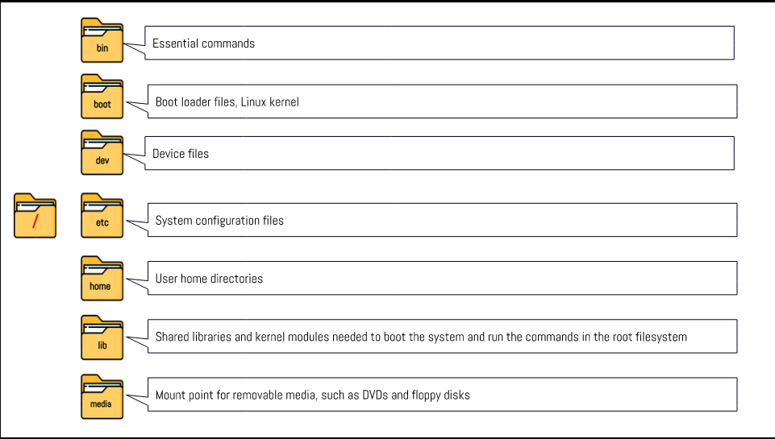

# Week Report 4 

##  Practice from the presentation The Linux File system: 

### Practice 1
 

### Practice 2

##  The Linux File system directories and their purpose: 
 
 
 

## All the commands for navigating the filesystem 
| Command | What it does              | Syntax | Example |
| ------- | ------------------------- | ------ | ------- |
| pwd     | prints current directory  | pwd    | 'pwd'   |
| cd      | changes current directory | cd     | 'cd'    |
| ls      | lists                     | ls     | 'ls'    |

## Basic terminology 

* **File system:** collection of files 
* **Current directory:** CD is the current directory where you are right now
* **parent directory:** current directory and the parent for sub directories
* **the difference between your home directory and the home directory:** the home directory in linux is the root which is the admin or head of the system and my home directory is the same thing but it is a user 
* **pathname:** name of a file
* **relative path:** describing the location of the file 
* **absolute path:**specifying the location of the file and narrowing it down

