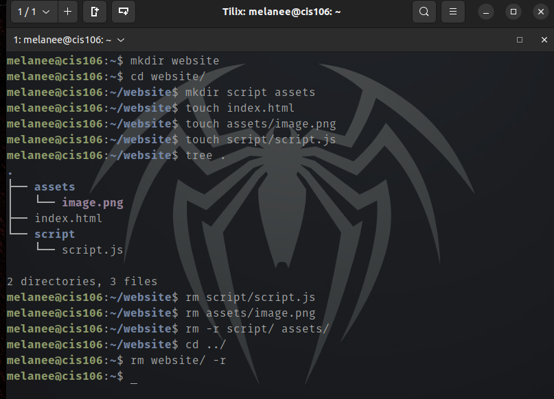
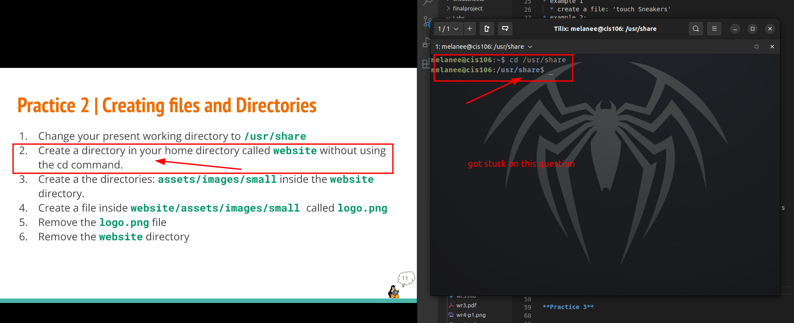

# week report 5 

## Answer to Questions:

**What are Command Options?**
SET of consecutive numbers or letters that follows the command and any arguments 

**What are Command Arguments?**
there given on the command line 

**Which command is used for creating directories? Provide at least 3 examples.**
the command is mkdir
* example 1 
    * create a directory: 'mkdir Games'
* example 2:
  * create multiple directories: 'mkdir movies ~/Downloads/games ~/Documents/hmw '

**What does the touch command do? Provide at least 3 examples.**
* example 1 
  * create a file: 'touch Sneakers'
* example 2:
  * create multiple files: 'touch Bape,LV,Nike  
  
**How do you remove a file? Provide an example.**
"rm sneakers"

**How do you remove a directory and can you remove non-empty directories in Linux? Provide an example**

* example 1
  * use rm or -r command : -r sneakers/chap1 

**Explain the mv and cp command. Provide at least 2 examples of each**
 **mv:**  using to move or rename files in the directories
 * example 1
   * moving a file: 'mv intro sneakers/chap1'
  
* example 2
  * moving files : 'mv chap1 sneakers'
   
 **cp:** copying files to one another 
 * example 1
    * copying multiple files: /ect/passwd /ect/group /ect/sneakers pass/backups/

* example 1
  * copying a file : /ect/passwd pass/backups/ 

**Practice 1** 
 

**Practice 2** 
 

**Practice 3** 

**Practice 4** 
